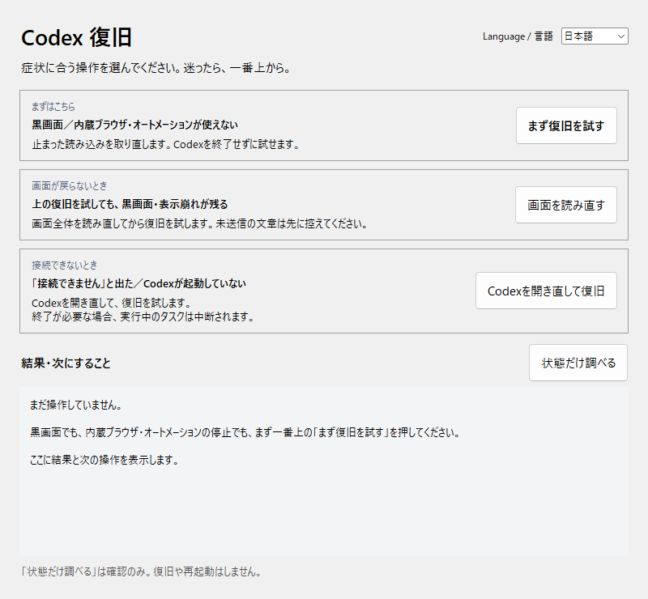

# Codex App Recovery

[English](README.md) | **日本語**

Windows版Codex（ChatGPTアプリ、MSIX版 `OpenAI.Codex`）の**送信停止・キューの操作不能・起動時のロゴ停止**を、アプリの外から自動で補正する非公式ツールです。アプリ本体のファイルは変更しません。

[MIT License](LICENSE)



## 対象の不具合（Codex 26.928.3736.0・26.928.4866.0 / app-server 0.159.2 で確認）

| 症状 | 原因 | このツールの対処 |
|---|---|---|
| 停止後、キューの「再開」を押しても送られない | サーバー側キューの再開処理が、会話を開いているだけで「実行中」と判定して何もしない | 実行中のターンも開始待ちもないときだけ、再開処理のその判定を補正する |
| キューの削除・送信・再開や、メッセージ送信が回り続ける | アプリ内部で応答が消えることがあり、画面側が期限なしで待ち続ける | 読み取り系の要求だけ同じ内容で再送し、届いた応答を元の要求に渡す |
| 起動するとロゴのまま進まない（読み直すと直る） | 起動直後のアプリサーバー初期化通知を画面が取りこぼす | 初期化情報の再送をアプリに要求する |

送信（ターン開始・追加指示）、キューへの追加、会話の再開は、二重実行を避けるため**一切再送しません**。

## インストール

必要なもの:

- Windows 11、MSIX版 `OpenAI.Codex`
- Python **3.10以降**とTcl/Tk（`py` または `python` が使えること）
- 初回セットアップ時のネット接続（依存パッケージは `websocket-client` のみ）

1. [Releases](https://github.com/tomhda/codex-app-recovery/releases)からZIPをダウンロードし、保存したい場所に展開します。
2. `Setup.bat`をダブルクリックします。フォルダ内の`.venv`に実行環境を作ります。
3. 確認に答えると、スタートメニューに次の2つを登録します。
   - **Codex（ガード付き）**：普段のCodexの起動に使う
   - **Codex 復旧**：状態の確認、点検、予備チャット

セットアップ後はフォルダを移動しないでください。移動した場合はショートカットと`.venv`を削除し、移動先でセットアップし直してください。

## 使い方

### 普段の起動

**Codex（ガード付き）**から起動します。

- Codexが起動していなければ、診断接続付きで起動し、自己修復ガードを有効にします。
- ガード付きで起動済みなら、Codexを前面に出すだけです。
- ガードなしで起動済みなら、開き直すかを確認します。実行中の作業は中断されるので、区切りがついてから「はい」を選んでください。

通常のChatGPTアイコンから起動した場合、ガードは働きません。

### Codex 復旧

| 表示 | 内容 |
|---|---|
| Codex／自己修復ガード／画面 | 5秒ごとに更新する現在の状態 |
| 今日の自動修復 | ガードが今日補正した件数 |
| 主ボタン | 状態に応じて「Codexを起動」「ガード付きで開き直す」「今すぐ点検」のどれか1つ |
| 画面を読み直す | Codexのメイン画面を再読み込みする（入力中の未送信の文章は消えることがある） |
| 最近の自動修復 | ガードが何をしたかの記録 |

「今すぐ点検」は、ガードの常駐プロセスと画面内のガードを確認して有効にし、起動時の補正を実行します。起動画面のまま止まっている場合だけ、確認のうえ画面を1回読み直します。

### 予備チャット

Codexの画面が使えないときのために、公式の`codex app-server`へ直接つなぐ独立したチャットを用意しています。デスクトップの送信キューは経由しません。モデルは gpt-6.1-sol / high、読み取り専用サンドボックスと`on-request`承認で始まります。会話は`%LOCALAPPDATA%\CodexAppRecovery\chat-session.json`に保存されます。

## 表示言語

画面右上の **Language / 言語** で日本語と英語を切り替えます。選んだ言語は次回も使われます。初回はWindowsの表示言語に従います。

## ローカル診断接続とログ

ガードは、Codexを`--remote-debugging-address=127.0.0.1 --remote-debugging-port=9222`付きで起動して動作します。診断接続は、認証済みのアプリを操作できる強い権限を持ちます。**9222番ポートを外部へ公開しないでください。** 本ツールは、ポートの所有プロセスが現在のCodexであり、ループバックに限定されていることを確認してから接続します。同じPCで動く他のプログラムも、この間はポートに接続できます。

ガードの記録は`%LOCALAPPDATA%\CodexAppRecovery\guard\guard-YYYYMMDD.jsonl`に残ります。要求の種類、経過時間、件数だけを記録し、会話本文・設定本文・認証情報は保存しません。ツールからの外部送信はありません。

## 仕組み

- `guard.js`：Codexの画面（メイン・アバター・別窓）に読み込まれ、アプリ自身が流す送受信イベント（`codex-message-from-view` と `message`）を監視します。再送するのは、この版で確認した読み取り要求（完全一致の名前の一覧）だけです。サーバー要求は45秒、内部要求は30秒たっても応答がなければ、送った時点の内容のまま再送し、最大3回で打ち切ります（打ち切っても失敗は返しません）。応答は、同じ要求・同じホストに対してだけ渡します。
- 再開と起動時の補正は、検証済みのアプリ版（アプリ内部の版 26.928.31416・26.928.40906）でだけ動きます。再開の補正は、同じ会話の再開が処理中なら重ねて実行しません。ガードを止めると元の処理に戻ります。
- `guard_daemon.py`：常駐プロセス。各画面にガードを読み込み、再読み込み後も読み込み開始時から入れ直します。Codexのログに、要求の開始後に「生きている画面へ応答を送出した」記録があるのに画面側がまだ待っている要求は、5秒で再読み取りします。画面の再読み込みや再起動はしません。Codexの終了後2分で終わります。
- `codex_control.py`：起動・終了・再読み込み・点検。終了はCodex自身の終了要求を使います。応答しない場合の強制終了は、開き直しとは別に確認し、確認した時点のプロセスだけを対象にします。

## 対応範囲と限界

- アプリ内部で応答が消える仕組みそのものは特定できていません。ガードは届かなかった応答を補いますが、消えること自体は防げません。
- 新規起動直後、常駐プロセスが接続するまでに出た要求はガードの対象外です（再読み込み以降は対象になります）。
- 書き込み系の要求（送信、キューへの追加・削除・並べ替え、設定の保存など）は、再送も失敗扱いもしません。
- キューの読み込みを救済すると、その読み込みを待っていた操作（再開・削除・今すぐ反映など）がそのまま続きます。押した操作は数秒以内に実行されます。
- クラウド実行（durable）の会話で出る「AbsolutePathBuf deserialized without a base path」は、Windowsのフォルダをクラウド側の作業パスに連結してしまうアプリ側の別の不具合で、このツールの対象外です。Windowsのフォルダを使う作業はローカル実行にしてください。
- アプリの更新で内部構造が変わると、補正が働かなくなることがあります。補正の対象が見つからない場合、補正は何もしません。

## 開発・テスト

```powershell
py -3 setup_recovery.py --no-shortcuts
.\.venv\Scripts\python.exe -m unittest discover -s tests -v
node tests/test_guard.mjs
.\.venv\Scripts\python.exe recovery.py --gui-smoke
```

自分の環境へ配置する場合（仮想環境を使わず、実行中のPythonで動かす）:

```powershell
py -3 scripts/deploy_local.py
```

`%USERPROFILE%\.codex\tools\app-recovery`へ実行ファイルをコピーし、ショートカットを作り直して常駐プロセスを再起動します。以前のファイルは`%LOCALAPPDATA%\CodexAppRecovery\backups`へ移します。

コマンドラインからの状態確認: `recovery.py --status`、点検: `recovery.py --checkup`、ガード付き起動: `recovery.py --launch`。

MIT License。OpenAIとの提携・承認を示すものではありません。
