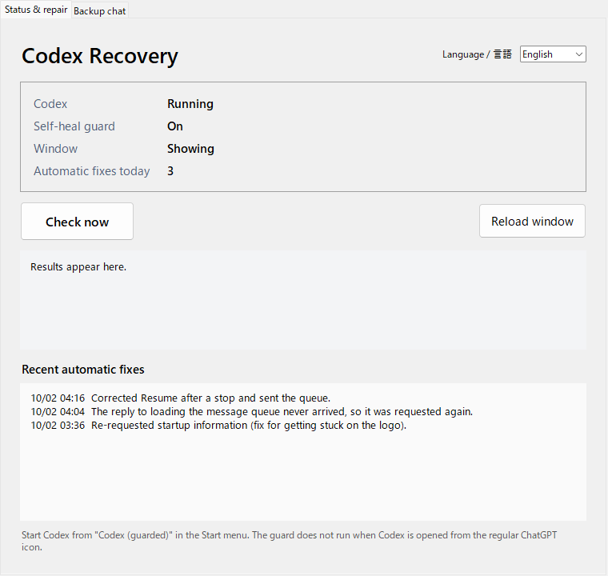

# Codex App Recovery

**English** | [日本語](README.ja.md)

An unofficial tool that corrects **stuck sends, unusable message queues, and startup stuck on the logo** in the Windows Codex app (ChatGPT app, MSIX package `OpenAI.Codex`) from outside the app. It does not modify the app's files.

[MIT License](LICENSE)



## Problems handled (seen on Codex 26.928.3736.0 / app-server 0.159.2)

| Symptom | Cause | What this tool does |
|---|---|---|
| After stopping a turn, **Resume** on the queue sends nothing | The app-server queue's resume treats "the chat is open in this window" as "running" and returns | Only when no turn is running or starting, it corrects that one check during resume |
| Deleting, sending or resuming queued messages, or sending a message, spins forever | A reply is sometimes lost inside the app while the window waits without a deadline | Re-sends read-only requests with the same content and hands the reply to the original request |
| Startup stays on the logo (reloading fixes it) | The window misses the one-time app-server "initialized" message at startup | Asks the app to send the initialization information again |

Sends (turn start, follow-up instructions), adding to the queue and resuming a chat are **never re-sent**, to avoid running anything twice.

## Install

Requirements:

- Windows 11 with the MSIX package `OpenAI.Codex`
- Python **3.10 or later** with Tcl/Tk (`py` or `python` available)
- Internet access during setup (the only dependency is `websocket-client`)

1. Download the ZIP from [Releases](https://github.com/tomhda/codex-app-recovery/releases) and extract it where you want to keep it.
2. Double-click `Setup.bat`. It creates a `.venv` in the folder.
3. When asked, it adds two Start-menu entries:
   - **Codex (guarded)**: use this to start Codex every day
   - **Codex Recovery**: status, checkup and a backup chat

Do not move the folder after setup. If you do, delete the shortcuts and `.venv` and run setup again in the new place.

## Use

### Starting Codex

Start Codex from **Codex (guarded)**.

- If Codex is not running, it starts with the local diagnostic connection and the self-heal guard.
- If Codex already runs with the guard, it only brings Codex to the front.
- If Codex runs without the guard, it asks before restarting. Running work is interrupted, so choose Yes once it reaches a stopping point.

The guard does not run when Codex is opened from the regular ChatGPT icon.

### Codex Recovery

| Item | Meaning |
|---|---|
| Codex / Self-heal guard / Window | Current state, refreshed every 5 seconds |
| Automatic fixes today | How many times the guard corrected something today |
| Main button | One of Start Codex, Restart with guard, or Check now, depending on the state |
| Reload window | Reloads the Codex main window (unsent text in the message box may be lost) |
| Recent automatic fixes | What the guard did |

**Check now** makes sure the background helper and the in-window guard are running, and runs the startup correction. Only if the window is still on the startup screen does it offer to reload the window once.

### Backup chat

For times when the Codex window cannot be used, a separate chat connects directly to the official `codex app-server`. It does not use the desktop message queue. It uses gpt-6.1-sol / high and starts with a read-only sandbox and `on-request` approvals. Conversations are saved in `%LOCALAPPDATA%\CodexAppRecovery\chat-session.json`.

## Language

Use **Language / 言語** at the top right to switch between Japanese and English. The choice is kept. The first launch follows the Windows display language.

## Local diagnostic connection and logs

The guard works by starting Codex with `--remote-debugging-address=127.0.0.1 --remote-debugging-port=9222`. That connection can control the signed-in app. **Do not expose port 9222 outside this PC.** The tool connects only after checking that the port belongs to the current Codex process and is bound to loopback. Other programs on the same PC can also reach the port while it is open.

Guard activity is written to `%LOCALAPPDATA%\CodexAppRecovery\guard\guard-YYYYMMDD.jsonl`: request kinds, ages and counts only. Chat text, settings and credentials are not stored. The tool sends nothing off the PC.

## How it works

- `guard.js` runs in the Codex windows (main, avatar, detached) and watches the app's own send and receive events (`codex-message-from-view` and `message`). It re-sends only read requests confirmed in this app version (an exact list of names). App-server requests without a reply after 45 s and internal requests after 30 s are re-sent as they were originally sent, at most three times; giving up returns no error. A reply is handed only to the same request on the same host.
- The Resume and startup corrections run only on the verified app version (internal version 26.928.31416). The Resume correction does not run twice for a chat whose resume is still in progress, and stopping the guard restores the original code.
- `guard_daemon.py` is the background helper. It loads the guard into each window, from the first script after a reload. When the Codex log shows a reply was routed to a live window after the request started while the window is still waiting, it re-reads after 5 s. It never reloads or restarts Codex. It exits two minutes after Codex closes.
- `codex_control.py` starts, quits, reloads and checks Codex. Quitting uses Codex's own quit request. Forcing Codex to close when it does not respond is confirmed separately from the restart, and only the processes present at that confirmation are closed.

## Limits

- What makes replies disappear inside the app is not known. The guard makes up for replies that never arrive; it cannot stop them from being lost.
- Requests sent right after a new start, before the helper connects, are not covered (they are after the next reload).
- Write requests (sends, adding, deleting or reordering queued items, saving settings) are never re-sent or failed.
- When a queue read is rescued, actions waiting for it (Resume, delete, send now) continue. What you pressed runs within a few seconds.
- "AbsolutePathBuf deserialized without a base path" in cloud-run (durable) chats is a separate app bug: a Windows folder is joined onto the cloud working path. It is outside this tool's scope; use local runs for work in Windows folders.
- An app update can change the internals the corrections rely on. When the parts are not found, the corrections do nothing.

## Development and tests

```powershell
py -3 setup_recovery.py --no-shortcuts
.\.venv\Scripts\python.exe -m unittest discover -s tests -v
node tests/test_guard.mjs
.\.venv\Scripts\python.exe recovery.py --gui-smoke
```

To install for yourself with the Python you run it with (no virtual environment):

```powershell
py -3 scripts/deploy_local.py
```

It copies the runtime files to `%USERPROFILE%\.codex\tools\app-recovery`, recreates the shortcuts and restarts the helper. Previous files move to `%LOCALAPPDATA%\CodexAppRecovery\backups`.

Command line: `recovery.py --status` (state), `recovery.py --checkup` (checkup), `recovery.py --launch` (guarded start).

MIT License. Not affiliated with or endorsed by OpenAI.
